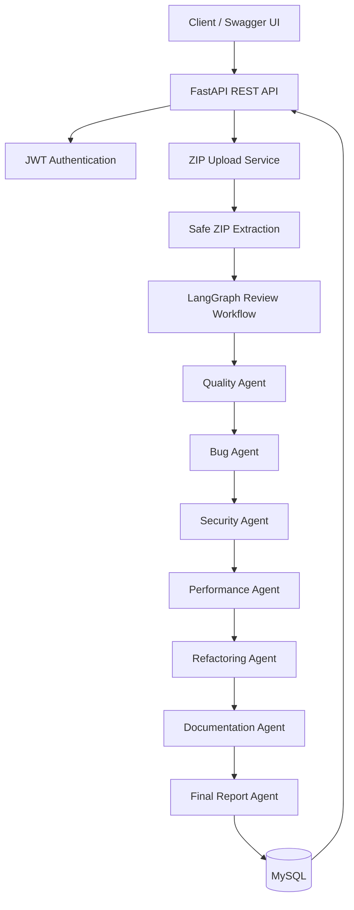

# AI Multi-Agent Code Review Platform

A beginner-friendly FastAPI backend that accepts a ZIP file containing source code, runs six focused Gemini-powered code-review agents through LangGraph, combines their findings into a final report, and stores the results in MySQL.

The project is deliberately structured like a small production backend while keeping functions, modules, and data flow easy to follow.

## What it does

1. A user registers and receives a JWT after login.
2. The user uploads a repository ZIP file.
3. The API stores the ZIP locally, safely extracts it into a temporary folder, and reads supported source files.
4. LangGraph runs quality, bug, security, performance, refactoring, and documentation agents.
5. A final agent combines those findings into scores and prioritized next steps.
6. The API saves the repository, final report, and all detailed agent reports in MySQL.

## Architecture



## Technology

- Python 3.12
- FastAPI and Swagger UI
- SQLAlchemy and MySQL
- Alembic dependency for database migrations
- JWT and bcrypt password hashing
- LangGraph
- Google Gemini API (`google-genai`)
- Docker and Docker Compose
- Pytest

## Folder guide

```text
app/
├── agents/          # Gemini prompts and one agent function per review concern
├── crud/            # Small direct SQLAlchemy database functions
├── dependencies/    # Reusable FastAPI dependencies, including current-user lookup
├── exceptions/      # Application-specific errors
├── langgraph/       # Shared graph state and sequential workflow
├── middleware/      # Reserved for future reusable middleware
├── models/          # SQLAlchemy table definitions
├── routers/         # Authentication, repository, and report endpoints
├── schemas/         # Pydantic request and response validation models
├── services/        # ZIP storage, extraction, and source-file reading
├── uploads/         # Local ZIP storage (ignored by Git)
├── config.py        # Environment-based configuration
├── database.py      # Engine, sessions, and SQLAlchemy base class
├── main.py          # FastAPI application and exception handlers
└── security.py      # Password hashing and JWT helpers

tests/               # Isolated unit and API tests
```

## Local installation

### 1. Create a virtual environment

Use Python 3.12.

```powershell
py -3.12 -m venv .venv
.\.venv\Scripts\Activate.ps1
pip install -r requirements.txt
```

### 2. Configure environment variables

```powershell
Copy-Item .env.example .env
```

Open `.env` and replace at least these placeholder values:

- `MYSQL_PASSWORD`
- `MYSQL_ROOT_PASSWORD`
- `SECRET_KEY` — use a long random value
- `GEMINI_API_KEY`

For a locally installed MySQL server, set `MYSQL_HOST=localhost`. For Docker Compose, keep `MYSQL_HOST=mysql`.

### 3. Start MySQL and run the API

Create the database tables through your Alembic migration before starting the API. Then run:

```powershell
uvicorn app.main:app --reload
```

Open:

- Swagger UI: [http://localhost:8000/docs](http://localhost:8000/docs)
- OpenAPI JSON: [http://localhost:8000/openapi.json](http://localhost:8000/openapi.json)

## Docker setup

1. Copy `.env.example` to `.env` and set real values.
2. Ensure `MYSQL_HOST=mysql` in `.env`.
3. Run:

```powershell
docker compose up --build
```

The API is available at `http://localhost:8000`, and MySQL is available on port `3306`. The `mysql_data` Docker volume preserves database data across container restarts.

## API overview

All endpoints except registration and login require this header:

```http
Authorization: Bearer <access_token>
```

| Method | Endpoint | Purpose |
| --- | --- | --- |
| POST | `/register` | Create an account |
| POST | `/login` | Receive a JWT bearer token |
| POST | `/logout` | Record logout; client discards its JWT |
| GET | `/me` | Get the current user |
| PUT | `/profile` | Update the current user |
| DELETE | `/profile` | Delete the user and owned data |
| POST | `/upload` | Upload and analyze a repository ZIP |
| GET | `/repositories` | List current user repositories |
| GET | `/repository/{id}` | Get one repository |
| DELETE | `/repository/{id}` | Delete a repository and its reports |
| GET | `/reports` | List current user reports |
| GET | `/report/{id}` | Get a full report with all agent outputs |
| DELETE | `/report/{id}` | Delete a report |

## Example requests

### Register

```bash
curl -X POST http://localhost:8000/register \
  -H "Content-Type: application/json" \
  -d '{"name":"Ada Lovelace","email":"ada@example.com","password":"safe-password-123"}'
```

### Login

```bash
curl -X POST http://localhost:8000/login \
  -H "Content-Type: application/json" \
  -d '{"email":"ada@example.com","password":"safe-password-123"}'
```

Example response:

```json
{
  "access_token": "eyJ...",
  "token_type": "bearer"
}
```

### Upload a project

```bash
curl -X POST http://localhost:8000/upload \
  -H "Authorization: Bearer <access_token>" \
  -F "uploaded_file=@my-project.zip"
```

Example response:

```json
{
  "repository_id": 1,
  "report_id": 1,
  "overall_score": 84.0,
  "message": "Repository uploaded and analyzed successfully."
}
```

## Source-code and ZIP rules

- Upload only `.zip` files.
- Supported source files: Python, JavaScript, TypeScript, Java, and C++.
- Ignored folders: `.git`, `node_modules`, `venv`, `build`, `dist`, and `__pycache__`.
- ZIP paths are checked to prevent extraction outside the temporary folder.
- Upload and extracted-size limits are configured in `.env`.

## Testing

Run the test suite with:

```powershell
pytest -q
```

Tests use an in-memory SQLite database so they do not change MySQL data. The included tests cover password/JWT helpers and the register → login → `/me` flow.

> Development-machine note: tests were syntax-checked in the supplied workspace but not run there because Python 3.12 and `pytest` were unavailable.

## Learning path

Start with `app/main.py` to see how the API is assembled. Next read `app/database.py`, the models, and `app/routers/auth.py`. Once the request/response flow is clear, follow `app/routers/repositories.py` into the upload and LangGraph services.

## Future improvements

- Add and commit the initial Alembic migration before deployment.
- Add pagination for repositories and reports.
- Add background job processing for very large repositories.
- Add rate limiting and JWT token revocation for stronger logout behavior.
- Add file-level source size limits and prompt chunking for larger projects.
- Add more integration tests, including mocked Gemini responses and ZIP extraction tests.